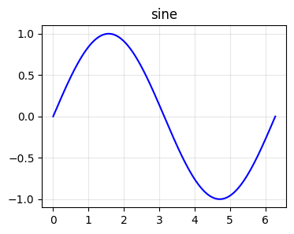

# Quarto 最新機能の採用メモ

このテンプレートは Quarto Book を安定運用することを優先し、最新機能は次の基準で採用する。

- 既存の `just check` と GitHub Pages 公開を壊さないものはサンプルや設定に反映する
- Quarto のバージョン差で壊れやすいもの、追加の検証ツールが重いものはドキュメントで導入手順を示す
- 教科書本文に関係しない公開先固有の機能は、デフォルトでは有効化しない

## リリース別の注目点

教科書テンプレートに関係するものだけを抜粋する。

| Quarto | 注目点 | showcase への追加判断 |
| --- | --- | --- |
| 1.9 | `fig-alt` の PDF 反映、`pdf-standard`、list table、Typst book、LLM-friendly output、`quarto use brand` | `fig-alt` と list table は採用済み。PDF/Typst/LLM/brand は opt-in |
| 1.8 | HTML accessibility checks (`axe`)、HTML tabset の改善、typst / dashboard / manuscript / revealjs の改善 | axe は調査用設定として docs。tabset は既存 showcase で維持。その他は用途別 docs |
| 1.7 | dashboards、typst、Lua filter、cross-reference、PDF/HTML 出力まわりの改善 | book 本文に直結するものは限定的。dashboard は教材補助アプリ向けに別ページ化する場合だけ |
| 1.6 | `contents` shortcode、`.landscape` div、typst、dashboards、Jupyter/Knitr 実行まわりの改善 | `contents` と `.landscape` は本文 showcase に追加候補。typst は opt-in |
| 1.5 | typst 出力、dashboard / manuscript の発展、計算・拡張まわりの改善 | PDF を高速化したい場合の別プロファイル候補 |
| 1.4 | cross-reference、code annotation、HTML 出力、project / preview まわりの改善 | code annotation と cross-reference は既存 showcase で採用済み |

## Quarto 1.9 系で注目する機能

Quarto 1.9 では、教科書テンプレートに関係する機能として以下が追加・強化されている。

| 機能 | このテンプレートでの扱い |
| --- | --- |
| `fig-alt` の PDF 出力反映 | 図版サンプルで `fig-alt` を書く方針にする。HTML と PDF の両方でアクセシビリティを落としにくい |
| `pdf-standard` | PDF/A や PDF/UA が必要な案件で opt-in。`verapdf` 検証が絡むためデフォルトでは無効 |
| list table | 複雑な表を grid table より保守しやすく書ける。`_07_figures_and_tables.qmd` に実例を追加済み |
| Typst book | 高速な PDF 作成候補。LaTeX 前提の `preamble.tex` と併用できないので、別プロファイル化して採用する |
| LLM-friendly website output | サイト全体を LLM に読ませたい場合に有用。ただし Quarto Book project では導入形が変わる可能性があるため、現時点では手順化に留める |
| `quarto use brand` | 複数教材でロゴ・色・CSS を共有する運用になったら採用する |

## すぐ採用する設定・書き方

図には代替テキストを書く。

```markdown
{#fig-sine fig-alt="0 から 2π までの正弦波"}
```

HTML のアクセシビリティ確認が必要なときは、一時的に `format.html.axe` を有効にする。

```yaml
format:
  html:
    axe:
      output: json
```

`output: json` は browser console に axe-core の結果を出すため、Playwright などで拾いやすい。`output: document` はページ内にレポートを埋め込めるが、Quarto Live を含む Book では Quarto 1.8.26 時点で render 時に干渉するケースがあるため、このテンプレートの profile では `json` を使う。

このテンプレートでは opt-in profile として `quarto/_quarto-a11y.yml` を同梱している。

```bash
just render-a11y  # axe JSON console output 付きで HTML render
just docs-a11y    # axe JSON console output 付きで preview
```

Quarto のバージョン別に使える機能を確認したい場合は、次を実行する。

```bash
just quarto-capabilities
```

## Showcase に追加する価値が高いもの

### `contents` shortcode

`contents` shortcode は、同じページ内の div やセクションの中身を別の場所に再掲できる。教科書では「定義を本文で提示し、章末まとめで再掲する」「演習の前に重要事項だけ再掲する」用途に合う。

```markdown
::: {#key-definition}
重要な定義本文。
:::

::: {.callout-note}
## 再掲



:::
```

### `.landscape` div

`.landscape` は PDF 出力で横向きページを作る用途に向く。HTML では通常の div として表示されるため、showcase に入れても HTML preview を壊しにくい。大きな表、横長の比較図、年表に向いている。

```markdown
::: {.landscape}

| 長い項目 A | 長い項目 B | 長い項目 C |
| --- | --- | --- |
| ... | ... | ... |

:::
```

## Quarto 1.9+ 前提で使う例

複雑な表は list table にすると、grid table より差分が読みやすい。動く例は `quarto/textbook/_07_figures_and_tables.qmd` に含めている。

```markdown
::: {#tbl-workflow .list-table tbl-colwidths="[25,75]"}
導入作業の確認表

- - 作業
  - 確認内容

- - セットアップ
  - `just setup` 後に `just check-env` が通る

- - 本文追加
  - `_NN_topic.qmd` を作り、`textbook.qmd` に `` を 1 つ追加する

:::
```

PDF アクセシビリティや長期保存要件がある場合は、Quarto 1.9+ で `pdf-standard` を検討する。

```yaml
format:
  pdf:
    pdf-engine: xelatex
    pdf-standard: pdf/a-2b
```

厳密に PDF/UA を狙う場合は、見出し構造、図の `fig-alt`、表の意味構造、文書メタデータまで含めて確認する。自動検証には `quarto install verapdf` を使う。

## 今はデフォルト採用しないもの

`llms-txt` は LLM が読むためのサイト出力として有用だが、このテンプレートは `project.type: book` を使っている。Book の章構成、include された partial、公開先の `_book` 配置との相性を確認してから opt-in にする。

Typst book は高速な PDF 出力として魅力がある。ただし、このテンプレートには LaTeX 用の `preamble.tex` と XeLaTeX 前提の PDF 設定があるため、単純に `format.typst` を足すと「LaTeX で効く体裁」と「Typst で効く体裁」が分岐する。採用時は `quarto/_quarto.yml` を分けるか、Quarto profile を使う。

## 参照

- Quarto 1.9 release: https://opensource.posit.co/blog/2026-03-24_1.9-release/
- Quarto 1.8 release: https://opensource.posit.co/blog/2025-10-13_1.8-release/
- Quarto 1.6 release: https://opensource.posit.co/blog/2024-11-25_1.6-release/
- Quarto release builds: https://quarto.org/docs/download/release.html
- HTML accessibility checks: https://quarto.org/docs/output-formats/html-accessibility.html
- Tables / list tables: https://quarto.org/docs/authoring/tables.html
- Typst basics: https://quarto.org/docs/output-formats/typst.html
- Output for LLMs: https://quarto.org/docs/websites/website-llms.html
- Project scripts: https://quarto.org/docs/projects/scripts.html
