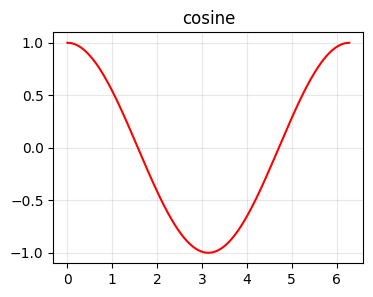
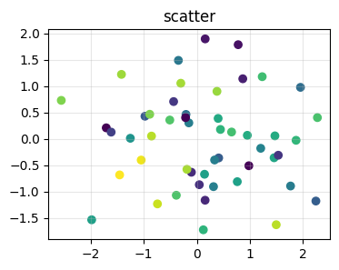

# 図表のレイアウト {#sec-figures-and-tables}

ここでは Quarto の **subfigure layout**、**margin / aside**、**lightbox gallery**、**pipe / grid table** + **table cross-ref** を実例で見せます。

## subfigure (layout-ncol) {#sec-subfig}

複数の図を 1 つの figure コンテナにまとめ、N 列に並べる:

::: {#fig-trig layout-ncol=2}

{#fig-sine}

{#fig-cosine}

三角関数の比較

:::

[@fig-trig] が親、[@fig-sine] / [@fig-cosine] が個別の subfigure を指します。

## column: page で本文幅を超えて広げる {#sec-column-page}

`column: page` を使うと本文幅 (1100px) より広い表示エリアを取れます。横長グラフや巨大な表に。

{#fig-wide .column-page}

## margin / aside (傍注) {#sec-margin}

本文の右マージンに補足情報を出す 2 つの方法。

[これは `.aside` 形式の傍注です。本文の流れを止めずに補足できます。]{.aside}

通常の段落です。`.aside` で囲んだ inline テキストは右マージンに小さく表示されます。

::: {.column-margin}
**Column-Margin Block**

`.column-margin` 形式では複数行・図・表もマージンに置けます。下に小さな図を置いた例:

{#fig-margin-sine width=80%}

:::

`.aside` は inline、`.column-margin` は block レベルと使い分けます。

## lightbox gallery {#sec-lightbox}

`_quarto.yml` で `lightbox: auto` を有効化済み。クリックすると拡大表示 + ギャラリーモードでナビゲーション。`group="..."` で同じグループの画像をまとめて見られます。

{group="trig-gallery" width=30%}
{group="trig-gallery" width=30%}
{group="trig-gallery" width=30%}

クリックして拡大、左右矢印で次の画像へ移動できます。

## pipe table {#sec-pipe-table}

軽量で読みやすい記法。テーブル幅は内容で自動調整。

| 関数 | 微分 | 積分 (定数省略) |
|:---|:---:|:---:|
| $\sin x$ | $\cos x$ | $-\cos x$ |
| $\cos x$ | $-\sin x$ | $\sin x$ |
| $e^x$    | $e^x$    | $e^x$    |
| $\ln x$  | $1/x$    | $x \ln x - x$ |

: 三角・指数・対数の微積分対応表 {#tbl-calculus}

[@tbl-calculus] のように `{#tbl-...}` ラベル + `@tbl-...` で参照できます。`:` の位置 (左/中央/右) で各列の整列を指定。

## grid table {#sec-grid-table}

セル内で複数行 / リスト / コードブロックを使いたい時は grid table。罫線を `+` `=` `-` `|` で書きます。

+----------+--------------------------+--------------------------+
| 環境     | コード例                 | 用途                     |
+==========+==========================+==========================+
| theorem  | `::: {#thm-name}`        | 定理 (番号付け)          |
+----------+--------------------------+--------------------------+
| proof    | `::: {.proof}`           | 証明 (番号なし)          |
+----------+--------------------------+--------------------------+
| callout  | `::: {.callout-tip}`     | 補足情報 (5 種)          |
+----------+--------------------------+--------------------------+
| tabset   | `::: {.panel-tabset}`    | タブ切替                 |
+----------+--------------------------+--------------------------+

: Quarto の代表的な div 構文 {#tbl-divs}

[@tbl-divs] には [@sec-callouts-default] / [@sec-tabset] / [@sec-theorems] が対応します。

## まとめ {#sec-figures-summary}

- subfigure → `layout-ncol=N` を親 div に
- 横長 → `.column-page`
- マージン補足 → inline は `.aside`、block は `.column-margin`
- lightbox → `_quarto.yml` に `lightbox: auto`、`group="..."` でギャラリー化
- 表 → 軽い場合 pipe table、複雑なら grid table
- 図表参照 → `{#fig-...}` `{#tbl-...}` を付け `@fig-...` `@tbl-...` で本文から参照
